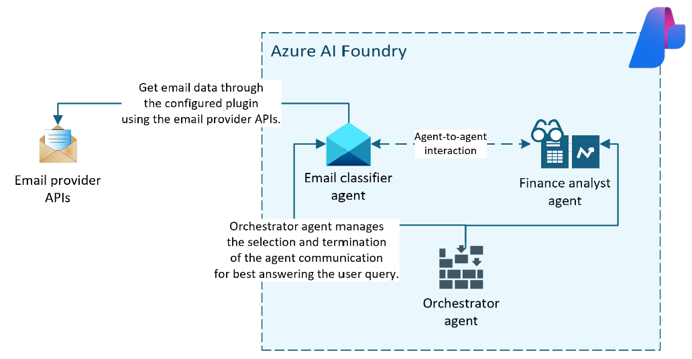

# Overview
A multi-agent personal finance system which helps the users in analyzing and identifying their spends across different categories for the specified period through their emails.

# Use case
Users trying to track their monthly expenses need to daily recall and fill up the details in one or the other apps manually. It is time consuming and requires continuous effort. In such scenarios, an agent acts as an assistant to automatically fetch emails periodically (as decided by the user) to identify the nature of their spends. The LLM in the agent can intelligently filter out important emails with respect to the different transactions which might have been made and summarize the results based on user query. 

# Design

## Email classifier agent
The Email classifier agent is configured with a plugin to get the emails for the logged in user. It is tasked to classify the emails as finance related or otherwise. The agent is instructed to identify emails like transactions and other emails which would be directly related to the transactions, e.g., purchase email from Amazon, travel bookings from Booking.com, etc. to enhance the categorization later within the specific merchant. For example, a user might have purchased a sports equipment (like Volleyball) and an apparel (like t-shirt) from a shopping site in a single order. The transaction alert would only mention the company name of the shopping site, while tracking emails from that website will also help further categorize the spend of `Shopping` into `Sports equipment` and `Apparel` respectively. The email classifier agent is suggested to output the classified emails in a fixed schema, which would be picked up by the Finance analyst agent for answering the user queries.

## Finance analyst agent
The Finance analyst agent depends on the response from the classifier agent to use the classified emails for answering user queries like: `Please share details of my spend by category for March 2025`.

## Orchestrator agent
The **Email classifier agent** and the **Finance analyst agent** are configured to participate in a group chat, i.e., to coordinate with each other for answering the user queries. Selection and termination strategies are defined such that the agents take turn after receiving the query and identify the best suitable response for the same. Termination strategy is even configured with maximum number of turns that can be taken for processing each query, to limit the compute time and provide a suitable response as soon as possible.

# Execution
## Pre-requisites
1. Python 3 (preferably v3.12)
2. Azure AI deployments like Azure AI Foundry with LLM deployment (currently the code uses `gpt-4o`).
3. A Google application authorized with the read-only permission on the Gmail inbox (i.e., read user messages). NOTE: If this is a test application, you will need to allow-list your email ID as the test email ID to allow application to read your emails. 

## Steps
1. Create a local copy of the `.env.example` file and save it as `.env` at the root of the project. 
2. Initialize a Python virtual environment using the command in Windows PowerShell:
```py
> python -m venv venv
```
3. Activate the virtual environment using following command:
```ps
> .\venv\Scripts\Activate 
```
4. Install the dependencies in the virtual environment.
```py
> pip install -r requirements.txt
```
5. Execute the orchestration notebook: `orchestrator.ipynb`. 

## Output and analysis
By default the `EXECUTION_MODE` environment variable is set to `local` to execute over the local demo data context. Thus, for testing and getting started quickly you would not be required to setup Gmail application and related access. The demo data is added in the `example_demo_data.json` file in the `email_plugin` folder. 

With just 10 emails in the demo data you can manually validate the categories and aggregated spend details with output from the orchestrator on successful exection.

**NOTE**: For testing purpose, the Gmail workflow in the email plugin is hard-coded to have time window as first 15 days of March 2025. This can be edited to suit your testing window as required.

# Resources
1. Azure AI agents for beginners: [ai-agents-for-beginners](https://github.com/microsoft/ai-agents-for-beginners/tree/main?tab=readme-ov-file).
2. Azure AI Foundry: [Azure AI Foundry | Docs](https://learn.microsoft.com/en-us/azure/ai-foundry/)
3. Semantic Kernel Python SDK: [semantic-kernel-python](https://github.com/microsoft/semantic-kernel/tree/main/python).
4. Configuring Gmail APIs for reading emails: [How to use Gmail API in Python](https://thepythoncode.com/article/use-gmail-api-in-python).

# Code of conduct
Please refer to the guidelines in our file here: [Code of conduct](CODE_OF_CONDUCT.md).

# License
Licensed under the [MIT](LICENSE) license.
